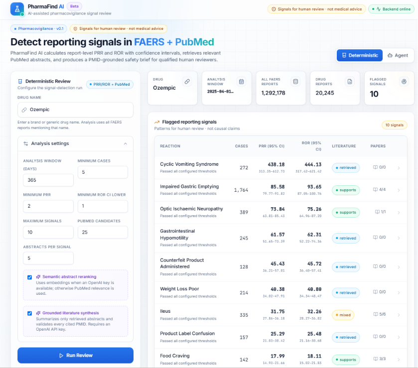
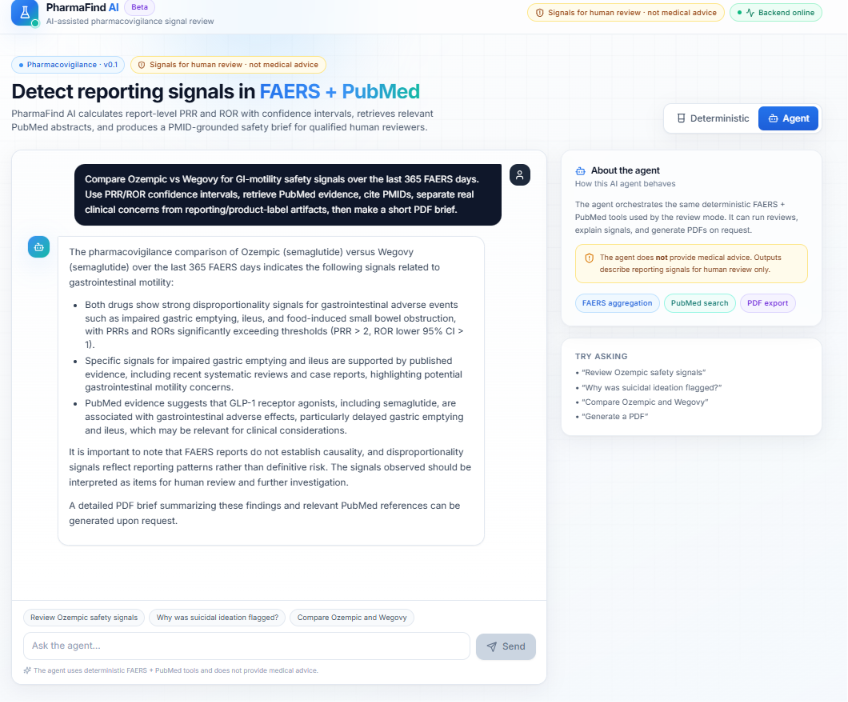
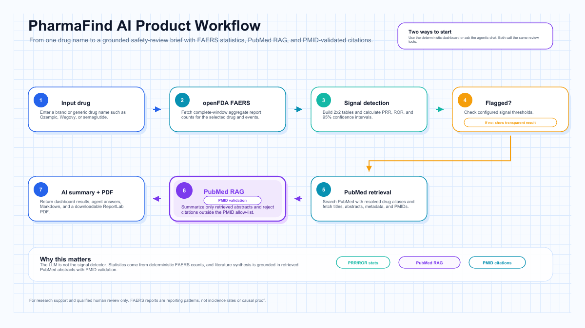
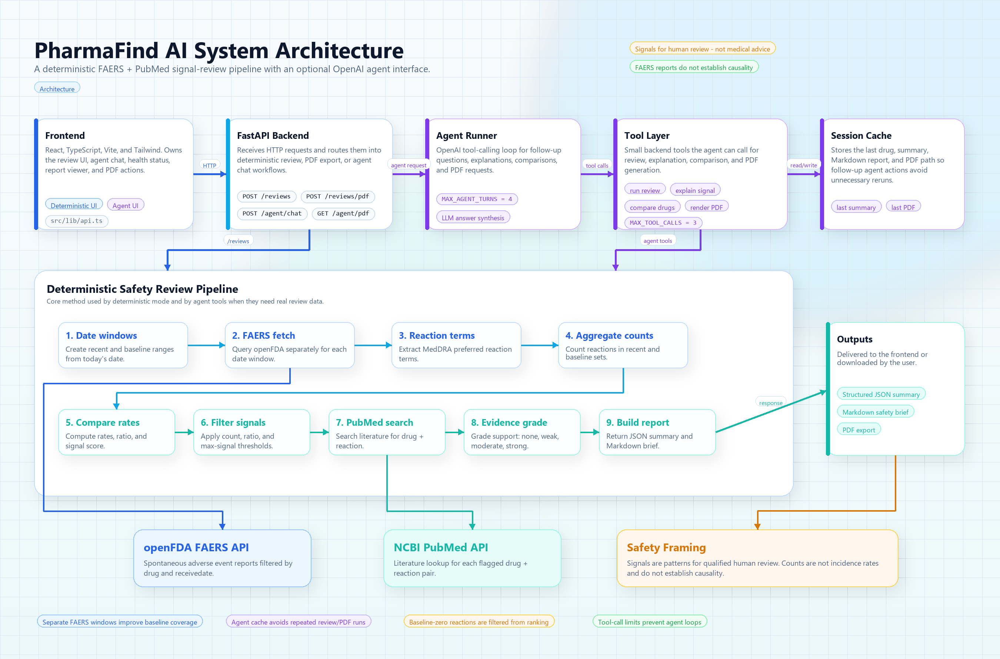

# PharmaFind AI

PharmaFind AI is a full-stack pharmacovigilance research tool for finding FAERS reporting signals, retrieving PubMed evidence, and producing grounded safety-review briefs.

> This project is not medical advice. FAERS reports identify reporting patterns only; they do not prove causality, incidence, or individual patient risk.

## What It Does

- Uses complete openFDA aggregate counts rather than capped raw-report samples.
- Builds a report-level 2x2 table for each drug/adverse-event pair.
- Calculates PRR, ROR, and 95% confidence intervals.
- Applies configurable minimum-case, PRR, and ROR-confidence-bound thresholds.
- Retrieves PubMed titles, abstracts, DOI, publication types, and PMIDs with NCBI ESearch + EFetch.
- Expands literature search terms with brand, generic, and active-substance aliases.
- Optionally reranks retrieved abstracts with OpenAI embeddings.
- Optionally summarizes only retrieved abstracts with structured OpenAI Responses output.
- Validates every generated PMID against the retrieved-paper allow-list.
- Exposes both a deterministic dashboard and an agent workflow.
- Produces typed JSON, Markdown, and ReportLab PDF exports.

## Current Screenshots and Sample Output

### Deterministic PRR/ROR review



### Agent workflow



### Example PDF

- [Ozempic safety review PDF](docs/example-output/ozempic_safety_review.pdf)
- [Example outputs page](docs/example-output.md)

## Product Workflow

At a glance, PharmaFind AI turns a drug name into a grounded safety-review brief. The deterministic dashboard and the agentic workflow both use this same review path.



- [Workflow PDF](docs/product-workflow.pdf)

## Architecture



- [Architecture notes](docs/architecture.md)
- [Architecture PDF](docs/architecture.pdf)

The deterministic FAERS pipeline is the source of truth, and flagged signals flow into a PubMed RAG path for retrieved-abstract synthesis and PMID-validated citations. Agent mode calls the same backend tools; it does not invent statistics or add uncited papers.

```mermaid
flowchart LR
    UI["React frontend"] --> API["FastAPI backend"]
    API --> FAERS["openFDA aggregate counts"]
    FAERS --> TABLE["2x2 contingency tables"]
    TABLE --> STATS["PRR / ROR / 95% CIs"]
    STATS --> FILTER["case + PRR + ROR CI thresholds"]
    FILTER --> PUBMED["PubMed ESearch + EFetch"]
    PUBMED --> RANK["PubMed relevance or embedding rerank"]
    RANK --> LLM["optional retrieved-abstract synthesis"]
    LLM --> PMID["PMID allow-list validation"]
    PMID --> REPORT["typed JSON + Markdown + ReportLab PDF"]
    RANK --> REPORT
    AGENT["Agent mode"] --> API
```



## Methodology

For one drug and one adverse event, the backend builds this report-level table:

| | Target event | Other events |
|---|---:|---:|
| Target drug | `a` | `b` |
| Other drugs | `c` | `d` |

```text
PRR = [a / (a + b)] / [c / (c + d)]
ROR = (a * d) / (b * c)
```

Default signal criteria:

- at least 5 drug/event reports;
- PRR at least 2;
- lower bound of the ROR 95% confidence interval greater than 1.

Passing signals are ranked by the lower ROR confidence bound, then by case count. If any 2x2 cell is zero, the backend applies a 0.5 Haldane-Anscombe correction and marks that in the result.

## FAERS Counting Pipeline

For each review:

1. Fetch the latest FAERS `receivedate` available through openFDA.
2. Build the selected analysis window ending on that date.
3. Count all FAERS reports in the window (`N`).
4. Count reports mentioning the selected drug (`D`).
5. Aggregate target-drug reaction counts (`a`).
6. Get each reaction's all-drug background count (`E`).
7. Derive `b = D - a`, `c = E - a`, and `d = N - D - E + a`.
8. Calculate PRR, ROR, CIs, thresholds, and ranking.

An optional `OPENFDA_API_KEY` raises the reaction aggregation limit from 100 to 1,000 terms. Without a key, openFDA returns the top 100 counted terms.

## PubMed RAG and Grounded Synthesis

For each flagged signal:

1. Resolve useful drug aliases from FAERS drug-name fields.
2. Search PubMed using NCBI ESearch.
3. Fetch abstract-level metadata using EFetch XML.
4. Optionally rerank candidate abstracts with embeddings.
5. Optionally ask the LLM for structured synthesis using only retrieved abstracts.
6. Validate every cited PMID against the retrieved-paper set.
7. Render citations deterministically in Markdown and PDF.

If embeddings fail or no OpenAI key is available, PubMed relevance order is used as a safe fallback. If grounded synthesis is disabled, the app still returns retrieved abstracts and PMID links.

## Agent Mode

Agent mode is useful when the user wants a workflow that normal search cannot do, for example:

```text
Compare Ozempic vs Wegovy for GI-motility safety signals over the last 365 FAERS days.
Use PRR/ROR confidence intervals, retrieve PubMed evidence, cite PMIDs, separate real
clinical concerns from reporting/product-label artifacts, then make a short PDF brief.
```

The agent can call backend tools for:

- running deterministic reviews;
- comparing drugs;
- explaining a selected signal;
- rendering the cached Markdown report as a PDF.

Tool limits and session caching prevent unnecessary repeated review/PDF runs.

## PDF Export

PDF export uses ReportLab. It is pure Python and works cleanly on Windows without WeasyPrint/Pango/Cairo native dependencies.

The deterministic review PDF route renders an already-generated Markdown report:

```json
{
  "drug_name": "Ozempic",
  "markdown_report": "# Safety Review Brief: Ozempic\n\n..."
}
```

This means clicking **Download PDF** does not re-run FAERS or PubMed. It renders the report already shown in the UI.

## Quick Start

### Backend

```powershell
python -m venv .venv
.\.venv\Scripts\Activate.ps1
pip install -r requirements.txt
uvicorn app.main:app --reload --host 127.0.0.1 --port 8000
```

The deterministic PRR/ROR pipeline and PubMed retrieval work without an OpenAI key.

### Optional environment variables

```powershell
$env:OPENFDA_API_KEY="your_openfda_key"
$env:NCBI_API_KEY="your_ncbi_key"
$env:NCBI_EMAIL="your-email@example.com"
$env:OPENAI_API_KEY="your_openai_api_key"
$env:OPENAI_SUMMARY_MODEL="gpt-4.1-mini"
$env:OPENAI_EMBEDDING_MODEL="text-embedding-3-small"
```

`OPENAI_API_KEY` enables embedding reranking, grounded literature synthesis, and agent mode.

### Frontend

```powershell
cd frontend
npm install
npm run dev
```

Open `http://127.0.0.1:5173`. Vite proxies `/api` requests to `http://127.0.0.1:8000`.

## API

| Method | Endpoint | Purpose |
|---|---|---|
| `GET` | `/health` | Backend readiness |
| `POST` | `/reviews` | Run PRR/ROR + PubMed review |
| `POST` | `/reviews/pdf` | Render existing Markdown as PDF |
| `POST` | `/agent/chat` | Use the tool-calling review agent |
| `GET` | `/agent/pdf` | Download the most recent agent PDF |

Example `/reviews` request:

```json
{
  "drug_name": "Ozempic",
  "analysis_days": 365,
  "min_case_count": 5,
  "min_prr": 2.0,
  "min_ror_ci_lower": 1.0,
  "max_signals": 10,
  "pubmed_candidate_count": 25,
  "max_pubmed_papers_per_signal": 5,
  "use_embeddings": true,
  "use_llm": false
}
```

Each returned signal includes:

- case count and complete contingency table;
- PRR and 95% CI;
- ROR and 95% CI;
- continuity-correction status;
- threshold explanations;
- PubMed total hits and retrieved abstracts;
- retrieval/reranking method;
- optional synthesis stance, claims, limitations, and PMID citations.

## Development and Verification

```powershell
python -m pytest -q
python -m compileall -q app scripts
cd frontend
npm run build
```

Live smoke checks:

```powershell
python -m scripts.run_review --drug "Ozempic" --max-signals 3
python -m scripts.check_pubmed --drug "semaglutide" --reaction "pancreatitis" --max-results 3
python -m scripts.check_signal_with_pubmed --drug "Ozempic" --max-papers 2
```

## Repository Structure

```text
app/
  api/                       FastAPI routes and typed schemas
  clients/
    faers_client.py          Aggregate/raw openFDA access and drug aliases
    pubmed_client.py         PubMed search and XML abstract retrieval
  pipeline/
    disproportionality.py    2x2 tables, PRR, ROR, confidence intervals
    signal_detector.py       Transparent signal criteria and ranking
    faers_signal_pipeline.py Complete-window count orchestration
    literature_retriever.py  PubMed retrieval and semantic reranking
    evidence_grader.py       Evidence models and PMID validation
    safety_review_pipeline.py Full deterministic/RAG workflow
  llm/
    evidence_synthesizer.py  Structured abstract-only synthesis
  reports/                   Markdown and ReportLab PDF rendering
  agent/                     Tool-calling agent workflow

frontend/src/
  lib/                       Typed API contracts and client
  components/review/         PRR/ROR dashboard and evidence modal
  components/agent/          Agent interface

docs/
  screenshots/               Current UI screenshots
  example-output/            Sample generated PDFs
  product-workflow.png       Product workflow diagram
  product-workflow.pdf       Printable workflow diagram
  architecture.png           Current architecture diagram
  architecture.pdf           Printable architecture diagram

tests/                       Statistics, retrieval, grounding, PDF, and API tests
scripts/                     Live external-service smoke checks
```

## Important Limitations

- This openFDA analysis includes all reports mentioning the selected drug; it is not restricted to primary-suspect drugs.
- openFDA returns latest report versions, but separate consumer and sponsor submissions describing the same event may remain.
- Drug normalization depends on reported and openFDA-harmonized name fields and can miss relevant aliases.
- FAERS reports may be incomplete, duplicated, stimulated by publicity, or affected by reporting bias.
- A drug and reaction appearing in the same report does not establish that the drug caused the reaction.
- PubMed retrieval and abstract synthesis support review; they do not establish causality.

## License

See [LICENSE](LICENSE).
