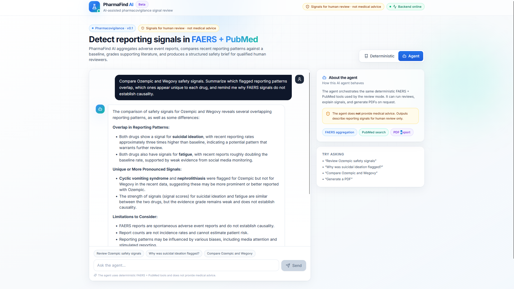

# PharmaFind AI

AI-assisted pharmacovigilance signal review using FAERS, PubMed, deterministic signal scoring, and an optional LLM-powered agent workflow.

PharmaFind AI is a full-stack research tool for exploring adverse-event reporting patterns. It takes a drug name, fetches FAERS reports, compares recent reporting frequency against a baseline window, flags unusual reporting signals, searches PubMed for related literature, grades the evidence, and produces a structured safety-review brief.

This project is designed as an engineering portfolio project: real external data sources, a typed FastAPI backend, a modern React dashboard, PDF export, and an agent interface that can operate deterministic backend tools.

> PharmaFind AI is not medical advice. FAERS reports are spontaneous reports and do not establish causality. Report counts are not incidence rates.

## Screenshots

### Deterministic Review Dashboard


### Agent Comparison Workflow



## What It Does

- Fetches adverse-event reports from openFDA FAERS.
- Splits reports into recent and baseline time windows.
- Extracts and aggregates MedDRA reaction terms.
- Compares recent reporting rates against baseline reporting rates.
- Computes a signal score for ranking reporting patterns.
- Searches PubMed for literature related to each flagged drug/reaction pair.
- Grades literature support as `none`, `weak`, `moderate`, or `strong`.
- Renders a deterministic Markdown safety-review brief.
- Optionally generates an LLM-written brief when an OpenAI API key is configured.
- Provides an agent mode for natural-language workflows such as:
  - reviewing a drug,
  - explaining a flagged signal,
  - comparing two drugs,
  - generating a PDF from the latest review.

## Why This Project Is Useful

Pharmacovigilance data is noisy. FAERS can surface useful reporting patterns, but raw report counts are easy to misread. PharmaFind AI keeps the workflow structured:

1. It separates recent reports from a baseline period.
2. It compares reporting rates rather than showing raw counts alone.
3. It keeps literature evidence separate from spontaneous-report patterns.
4. It uses conservative safety language and avoids causal claims.
5. It keeps deterministic results visible even when LLM features are unavailable.

The deterministic mode is the source of truth. The agent mode is a convenience layer for asking follow-up questions and orchestrating the same backend tools conversationally.

## Engineering Details And Optimizations

PharmaFind AI is intentionally structured so the LLM is not responsible for the core analysis. The data pipeline is deterministic, testable, and separated into small modules.

- **Separate recent and baseline FAERS queries:** the backend fetches recent and baseline windows independently by `receivedate` range instead of fetching one large mixed batch and splitting it afterward. This produces a much healthier baseline comparison.
- **Paged FAERS fetching:** openFDA unauthenticated requests are capped at 100 records per request, so the FAERS client pages with `limit` and `skip` until the requested window limit is reached.
- **Newest-first sorting:** FAERS queries default to `receivedate:desc`, which keeps recent-window reviews focused on current reports.
- **Bounded external requests:** FAERS and PubMed clients use request timeouts so a slow external API does not hang the app indefinitely.
- **Signal scoring instead of raw ranking:** reactions are ranked by a computed signal score based on reporting ratio and recent count, with log scaling so very common events do not dominate purely by volume.
- **Baseline-zero filtering in signal detection:** the signal detector requires minimum recent counts, minimum baseline counts, and minimum ratio thresholds, reducing noisy infinite-ratio outputs.
- **Session-state caching for agent workflows:** after an agent runs a review, the latest drug name, structured summary, Markdown report, and PDF path are cached in memory. Follow-up actions like "explain this signal" or "generate a PDF" can use the cached result instead of rerunning FAERS and PubMed.
- **Cached PDF rendering:** agent PDF generation renders from the last cached Markdown report rather than rerunning the full data pipeline.
- **Agent guardrails:** agent execution is capped with `MAX_AGENT_TURNS = 4` and `MAX_TOOL_CALLS = 3`, preventing runaway tool-calling loops and keeping requests predictable.
- **Deterministic fallback for LLM failures:** if LLM report generation is rate-limited, the backend falls back to the deterministic Markdown report instead of failing the whole review.
- **Frontend API isolation:** all frontend backend calls live in `frontend/src/lib/api.ts`, keeping UI components separate from networking details.
- **Vite proxy for local development:** the frontend uses `/api` with a Vite proxy to avoid browser CORS problems while the backend runs on `127.0.0.1:8000`.
- **Graceful error handling:** the UI parses FastAPI error shapes, preserves previous successful results, and shows friendly messages for offline backend, missing OpenAI key, quota/rate-limit errors, and PDF failures.
- **Safe pharmacovigilance wording:** both deterministic and agent outputs are framed as reporting-pattern signals for human review, not diagnoses, risk estimates, or causal claims.

## Tech Stack

### Backend

- Python
- FastAPI
- Pydantic
- requests
- OpenAI Python SDK
- openFDA FAERS API
- NCBI PubMed E-utilities
- Markdown report rendering
- Optional PDF rendering through WeasyPrint

### Frontend

- React
- TypeScript
- Vite
- Tailwind CSS
- lucide-react icons
- react-markdown

## System Architecture


A PDF version of the architecture diagram is available at [docs/architecture.pdf](docs/architecture.pdf).

The backend is organized around a deterministic review pipeline. The frontend sends review or agent requests to FastAPI. FastAPI either runs the review pipeline directly or lets the agent call small backend tools that reuse the same deterministic pipeline. External data comes from openFDA FAERS and NCBI PubMed. Outputs are returned as structured JSON, Markdown, PDF, or optional LLM-written narrative text.

## Methodology

PharmaFind AI uses a deterministic signal-review workflow first. The LLM is optional and does not decide which reactions are flagged.

1. **Configure the review:** the user provides a drug name plus analysis settings such as recent window length, baseline window length, maximum FAERS reports per window, maximum signals, and maximum PubMed papers per signal.

2. **Build two date windows:** the backend creates a recent window and a baseline window. For example, with `recent_days = 90` and `baseline_days = 365`, the recent window covers the latest 90 days and the baseline window covers the 365 days immediately before that.

3. **Fetch FAERS windows separately:** recent and baseline reports are queried independently from openFDA using the drug name and `receivedate` range. This avoids the earlier problem where fetching only the latest reports produced mostly recent data and left the baseline too small.

4. **Extract reaction terms:** for each FAERS report, the pipeline reads MedDRA preferred terms from `patient.reaction[].reactionmeddrapt`, normalizes them, and discards missing values.

5. **Aggregate counts:** reactions are counted separately for the recent and baseline windows.

6. **Compare reporting rates:** the pipeline compares reaction frequency across the two windows:

```text
recent_rate = recent_count / recent_report_count
baseline_rate = baseline_count / baseline_report_count
ratio = recent_rate / baseline_rate
```

7. **Score reporting signals:** reactions with enough baseline support are ranked with a simple score that combines reporting ratio and recent count:

```text
signal_score = log1p(recent_count) * ratio
```

8. **Filter noisy results:** the signal detector applies minimum recent count, minimum baseline count, minimum ratio, and maximum signal limits. This prevents reactions with `baseline_count = 0` from dominating the table with misleading infinite ratios.

9. **Search PubMed evidence:** for each flagged reaction, the backend searches PubMed using the drug name and reaction term.

10. **Grade literature support:** evidence is graded from the number of matching PubMed papers:

```text
0 papers      -> none
1-2 papers    -> weak
3-5 papers    -> moderate
more than 5   -> strong
```

11. **Build review outputs:** the final result is a structured JSON summary plus a deterministic Markdown safety brief. PDF export renders the Markdown report. If `use_llm` is enabled and an OpenAI API key is configured, the backend can also generate an LLM-written narrative brief from the deterministic summary.

12. **Agent workflow:** agent mode sits on top of the same deterministic tools. It can run a review, explain a flagged signal, compare two drugs, or generate a PDF from cached review results. Agent execution is bounded by maximum turn and tool-call limits to avoid unnecessary loops.

## Core Backend Endpoints

| Method | Endpoint | Purpose |
|---|---|---|
| `GET` | `/health` | Backend health check |
| `POST` | `/reviews` | Run a deterministic safety review |
| `POST` | `/reviews/pdf` | Generate and download a PDF report |
| `POST` | `/agent/chat` | Chat with the tool-using agent |
| `GET` | `/agent/pdf` | Download the most recent agent-generated PDF |

## Quick Start

These commands assume Windows PowerShell.

### 1. Clone The Repository

```powershell
git clone https://github.com/YOUR_USERNAME/pharmafind-ai.git
cd pharmafind-ai
```

### 2. Install Backend Dependencies

```powershell
python -m venv .venv
.\.venv\Scripts\Activate.ps1
pip install -r requirements.txt
```

### 3. Configure OpenAI API Access

Deterministic review mode does not require an OpenAI API key.

Agent mode and LLM-enhanced reports do require an OpenAI API key with API billing/credits enabled. ChatGPT Plus is separate from OpenAI API billing.

Set the key in the same PowerShell window where you start the backend:

```powershell
$env:OPENAI_API_KEY="your_openai_api_key_here"
```

Never commit real API keys to GitHub.

### 4. Start The Backend

```powershell
uvicorn app.main:app --reload --host 127.0.0.1 --port 8000
```

Check the backend:

```powershell
Invoke-WebRequest http://127.0.0.1:8000/health
```

Expected response:

```json
{"status":"ok"}
```

### 5. Install Frontend Dependencies

Open a second PowerShell window:

```powershell
cd C:\path\to\pharmafind-ai\frontend
npm install
```

### 6. Start The Frontend

```powershell
npm run dev
```

Open:

```text
http://127.0.0.1:5173
```

The frontend uses a Vite proxy, so browser requests to `/api` are forwarded to the backend at `http://127.0.0.1:8000`.

## Running Without OpenAI

You can use the main deterministic workflow without an OpenAI key:

- drug review,
- FAERS signal scoring,
- PubMed evidence lookup,
- Markdown report rendering.

The following features require OpenAI API access:

- Agent mode,
- LLM-enhanced narrative reports.

If the key is missing, invalid, out of credits, or rate-limited, the frontend displays a friendly message and deterministic review mode remains usable.

## Example Review Request

```bash
curl -X POST "http://127.0.0.1:8000/reviews" \
  -H "Content-Type: application/json" \
  -d '{
    "drug_name": "Ozempic",
    "recent_days": 90,
    "baseline_days": 365,
    "max_reports_per_window": 1000,
    "max_signals": 20,
    "max_pubmed_papers_per_signal": 5,
    "use_llm": false
  }'
```

Example response shape:

```json
{
  "summary": {
    "drug_name": "Ozempic",
    "recent_start": "2026-02-27",
    "recent_end": "2026-05-28",
    "baseline_start": "2025-02-26",
    "baseline_end": "2026-02-26",
    "recent_report_count": 879,
    "baseline_report_count": 1000,
    "signals": [
      {
        "reaction": "cyclic vomiting syndrome",
        "recent_count": 40,
        "baseline_count": 14,
        "recent_rate": 0.045,
        "baseline_rate": 0.014,
        "ratio": 3.25,
        "signal_score": 12.07,
        "evidence": {
          "paper_count": 0,
          "evidence_grade": "none",
          "papers": []
        }
      }
    ],
    "limitations": [
      "FAERS reports are spontaneous adverse event reports and do not establish causality.",
      "Report counts are not incidence rates and cannot estimate patient risk."
    ]
  },
  "markdown_report": "# Safety Review Brief..."
}
```

## Deterministic Review Mode

The dashboard review mode is built for reproducible signal exploration.

Inputs:

- drug name,
- recent window length,
- baseline window length,
- maximum FAERS reports per window,
- maximum flagged signals,
- maximum PubMed papers per signal,
- optional LLM narrative toggle.

Outputs:

- report-count summary cards,
- flagged reporting signal table,
- reaction detail modal,
- PubMed evidence details,
- Markdown report viewer,
- PDF export action.

## Agent Mode

Agent mode is a natural-language interface over deterministic backend tools. It is useful for workflows that are awkward in a form-based UI.

Example prompts:

```text
Review Atorvastatin safety signals.
```

```text
Why was suicidal ideation flagged?
```

```text
Compare Ozempic and Wegovy safety signals.
```

```text
Generate a PDF for the latest review.
```

The agent can call backend tools, use cached review state, compare drugs, explain flagged patterns, and request PDF generation. It should still be treated as a workflow assistant, not as a medical authority.

## PDF Export Notes

PDF export uses WeasyPrint on the backend.

On Windows, the Python package alone may not be enough. WeasyPrint can require native libraries such as Pango, Cairo, and GObject. If PDF export fails with an error such as:

```text
cannot load library 'libgobject-2.0-0'
```

install the required native dependencies or continue using Markdown export while developing.

The rest of the application does not require WeasyPrint to work.

## Safety And Data Limitations

This project intentionally avoids causal language.

Important limitations:

- FAERS reports are spontaneous adverse-event reports.
- FAERS reports do not establish that a drug caused an event.
- Report counts are not incidence rates.
- Reporting can be affected by duplicates, publicity, litigation, stimulated reporting, missing data, and reporting bias.
- PubMed search results are a literature signal, not proof of causality.
- Outputs are intended for research support and qualified human review.

## Development Commands

Backend:

```powershell
uvicorn app.main:app --reload --host 127.0.0.1 --port 8000
```

Frontend:

```powershell
cd frontend
npm run dev
```

Frontend build:

```powershell
cd frontend
npm run build
```

Run deterministic unit tests:

```powershell
python -m pytest
```

Run selected backend smoke scripts that call external APIs:

```powershell
python -m scripts.check_baseline_comparison --drug "Ozempic" --limit 1000
python -m scripts.run_safety_review --drug "Ozempic" --limit 1000
```

## Repository Structure

```text
app/
  api/          FastAPI routes and request/response schemas
  clients/      FAERS and PubMed API clients
  pipeline/     Review pipeline, signal detection, evidence grading
  reports/      Markdown and PDF rendering
  agent/        Tool-calling agent workflow
  llm/          Optional LLM report writer

frontend/
  src/          React + TypeScript UI
  src/lib/      API client, types, utilities
  src/components/
               Dashboard, review, agent, and common UI components

tests/
  Deterministic unit tests for the core pipeline

scripts/
  Manual smoke scripts for external FAERS/PubMed workflows

docs/
  architecture.png
  architecture.pdf
  screenshots/  README screenshots
```

## Portfolio Notes

This project demonstrates:

- full-stack application design,
- typed API contracts,
- external API integration,
- data pipeline decomposition,
- signal ranking and baseline comparison,
- LLM integration with deterministic fallbacks,
- human-centered safety wording,
- frontend dashboard design,
- pragmatic error handling for API keys, rate limits, and offline backend states.

It is intentionally framed as a pharmacovigilance signal-review assistant, not a diagnostic tool or medical recommendation system.
